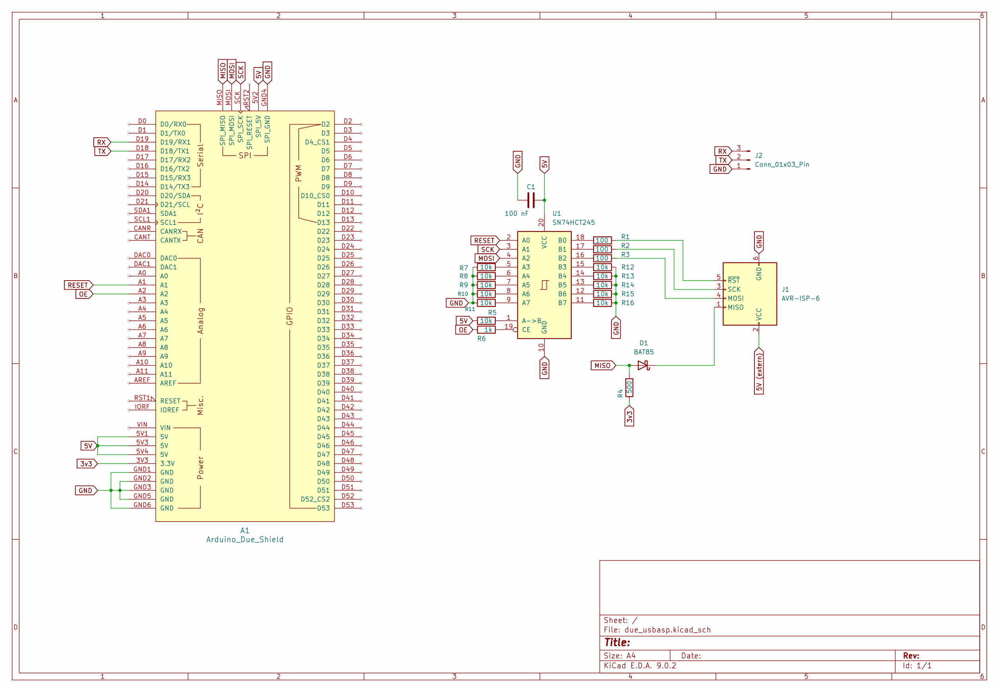

# Arduino Due USBasp Programmer


## Table of Contents
- [Features](#features)
- [Hardware Setup](#hardware-setup)
- [Building the Project](#building-the-project)
- [AVRDUDE Usage](#avrdude)

---

A high-speed, native USB ISP programmer implementation for the Arduino Due (SAM3X8E), emulating the popular **USBasp** protocol.

This project turns an Arduino Due into a robust AVR In-System Programmer (ISP) capable of flashing generic AVR microcontrollers (ATtiny, ATmega) using `avrdude`.

---

## Features

* **Native USB High-Speed:** Uses the SAM3X8E native USB peripheral (no USB-to-Serial converter latency).
* **Hybrid SPI Engine:**
  * **Hardware SPI:** For high-speed programming (up to 3 MHz).
  * **Software SPI:** Automatic fallback for low-speed targets (down to < 1 kHz) or rescue clocking.
* **Smart Timing:** Implements logic based on Microchip/Atmel ATDF specifications for robust timing and stability.
* **Smart Target Isolation:** Automatically disables the level shifter outputs (High-Impedance) when the programmer is idle. This allows the programmer to **remain permanently connected** to the target circuit without interfering with its normal operation.
* **Integrated CDC Serial Bridge:** Provides a virtual serial port (USB CDC) to communicate with the target's UART (e.g., debug output) without needing an extra USB-TTL adapter.
* **Extended Protocol:** Supports extended addressing for large Flash (>128kB) and robust page-writing logic.
* **Double Buffered USB:** Efficient endpoint handling to maximize throughput.

## Hardware Setup

> **Important:** Since the Arduino Due operates at **3.3V** and most AVR targets operate at **5V**, a level shifting circuit is **required**.

### Wiring Diagram



### Pin Mapping (Arduino Due SPI Header)

| Signal | Due Pin | Description |
| :--- | :--- | :--- |
| **MOSI** | SPI Header (MOSI) | Master Out Slave In |
| **MISO** | SPI Header (MISO) | Master In Slave Out |
| **SCK** | SPI Header (SCK)  | Serial Clock |
| **RST** | D55/A1 (or custom)   | Target Reset Control |
| **GND** | GND | Ground |
| **VCC** | 5V / 3.3V | Target Power |

### Recommended Circuit

To achieve stable communication at 3 MHz, the following protection and impedance matching circuit is implemented:

**1. Level Shifting & Isolation (3.3V Logic -> 5V Target)**
an **SN74HCT245** transceiver is used for signals going TO the target (MOSI, SCK, RST).

* **Boosting:** It boosts the Due's 3.3V signals to clean 5V TTL levels compatible with AVRs.
* **Isolation:** The firmware controls the **Output Enable (OE)** pin of the HCT245. When idle, the outputs are switched to high-impedance (tri-state), electrically disconnecting the programmer lines from the target.

**2. Protection (5V Target -> 3.3V Logic)**
a **BAT85 Schottky Diode** configuration protects the Due's MISO input:

* **Diode:** Anode to Due MISO, Cathode to Target MISO.
* **Pull-Up:** A strong **500Ω Pull-Up resistor** connects Due MISO to 3.3V.

**3. Impedance Matching**
**100Ω series resistors** are placed on SCK, MOSI, and RST lines to dampen reflections (ringing) on the cable.

## Building the Project

### Requirements

* **Toolchain:** `arm-none-eabi-gcc`
* **Utilities:** `cmake`, `ninja`
* **Flasher:** `bossac` or `Black Magic Probe`(for uploading to Due)

### Compilation

1. Clone the repository.

```bash
git clone https://github.com/Saryndor/due_usbasp_programmer.git
```

2. Change directory

```bash
cd due_usbasp_programmer
```

3. Create build folder

```bash
mkdir build && cmake -S . -B build -G Ninja
```

4. Build

```bash
cmake --build build
```

5. Clean

```bash
rm -rf build/* && cmake -S . -B build -G Ninja
```

### AVRDUDE

#### Verify device

```bash
avrdude -c usbasp-clone -p m328p  -vv
```

```bash
Avrdude version 8.1
Copyright see https://github.com/avrdudes/avrdude/blob/main/AUTHORS

Using port            : usb
Using programmer      : usbasp-clone
Seen device from vendor >Saryndor Dev.<
Seen product >USBasp+CDC<
AVR part              : ATmega328P
Programming modes     : SPM, ISP, HVPP, debugWIRE

Memory           Size  Pg size
------------------------------
eeprom           1024        4
flash           32768      128
lfuse               1        1
hfuse               1        1
efuse               1        1
lock                1        1
prodsig/sigrow     24        1
sernum             10        1
io                224        1
sram             2048        1
signature           3        1
calibration         1        1

Variants         Package  F max   T range         V range       
----------------------------------------------------------------
ATmega328P       N/A      20 MHz  [-40 C,   N/A]  [1.8 V, 5.5 V]

Programmer type       : usbasp
Description           : Any usbasp clone with correct VID/PID
Auto set sck period

AVR device initialized and ready to accept instructions
Reading | ################################################## | 100% 0.00 s 
Device signature = 1E 95 0F (ATmega328P, ATA6614Q, LGT8F328P)

Avrdude done.  Thank you.
```

#### Read Flash (default speed)

```bash
avrdude -c usbasp-clone -p m328p -U flash:r:/tmp/backup_m328p.hex:i
```

```bash
Reading flash memory ...
Reading | ################################################## | 100% 6.05 s 
Writing 7198 bytes to output file backup_m328p.hex

Avrdude done.  Thank you.
```

#### Read Flash (full speed)

```bash
avrdude -c usbasp-clone -p m328p -U flash:r:/tmp/backup_m328p.hex:i -B 3Mhz
```

```bash
Set SCK frequency to 3000000 Hz
Reading flash memory ...
Reading | ################################################## | 100% 0.71 s 
Writing 7198 bytes to output file backup_m328p.hex

Avrdude done.  Thank you.
```

#### Write Flash (default speed)

```bash
avrdude -c usbasp-clone -p m328p -U flash:w:/tmp/backup_m328p.hex:i
```

```bash
Reading 7198 bytes for flash from input file backup_m328p.hex
Writing 7198 bytes to flash
Writing | ################################################## | 100% 1.93 s 
Reading | ################################################## | 100% 1.38 s 
7198 bytes of flash verified

Avrdude done.  Thank you.
```

#### Write Flash (full speed)

```bash
avrdude -c usbasp-clone -p m328p -U flash:w:/tmp/backup_m328p.hex:i -B 3Mhz
```

```bash
Set SCK frequency to 3000000 Hz
Reading 7198 bytes for flash from input file backup_m328p.hex
Writing 7198 bytes to flash
Writing | ################################################## | 100% 0.73 s 
Reading | ################################################## | 100% 0.17 s 
7198 bytes of flash verified

Avrdude done.  Thank you.
```

## License

[MIT](LICENSE)
